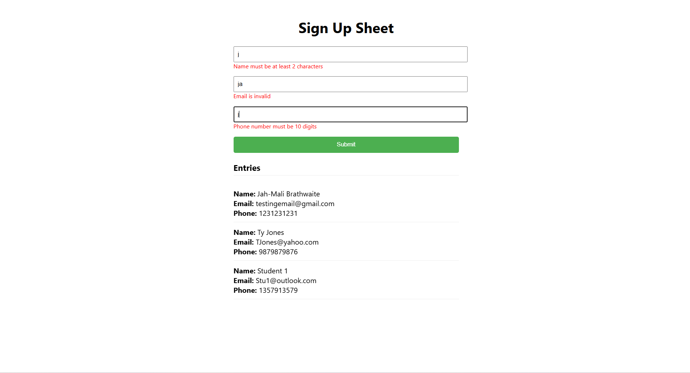

# Forms



## Description  
A simple Sign-In form using React forms

### Running the app

1. Clone the repository of the project in the terminal using:
````
git clone https://github.com/JahmaliB/Forms.git
````

2. Change your current directory to the project's directory using:
````
cd forms
````

3. Install the dependencies needed to run the program using:
````
npm install
````

4. Start the server using:
````
npm start
````

5. (Optional) Your program should open automatically but if it does not copy and paste this into your browser:
'http://localhost:3000'
